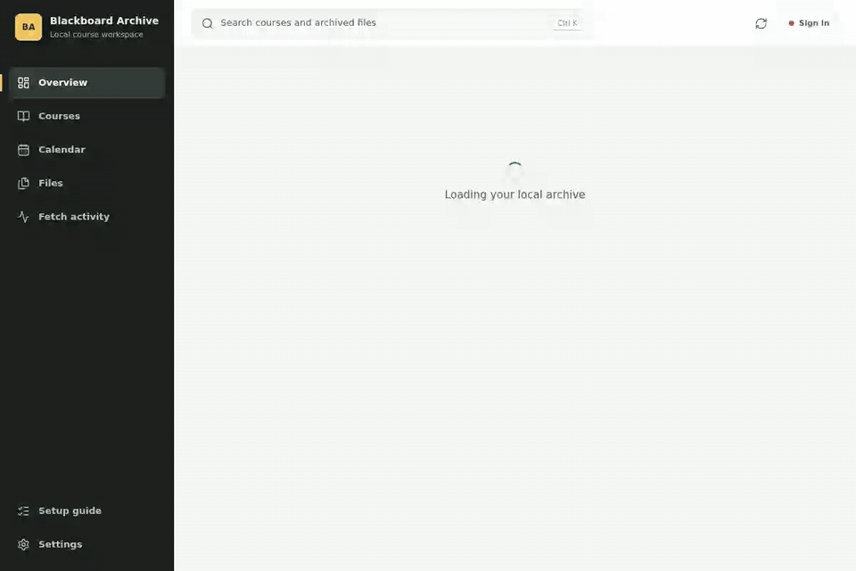
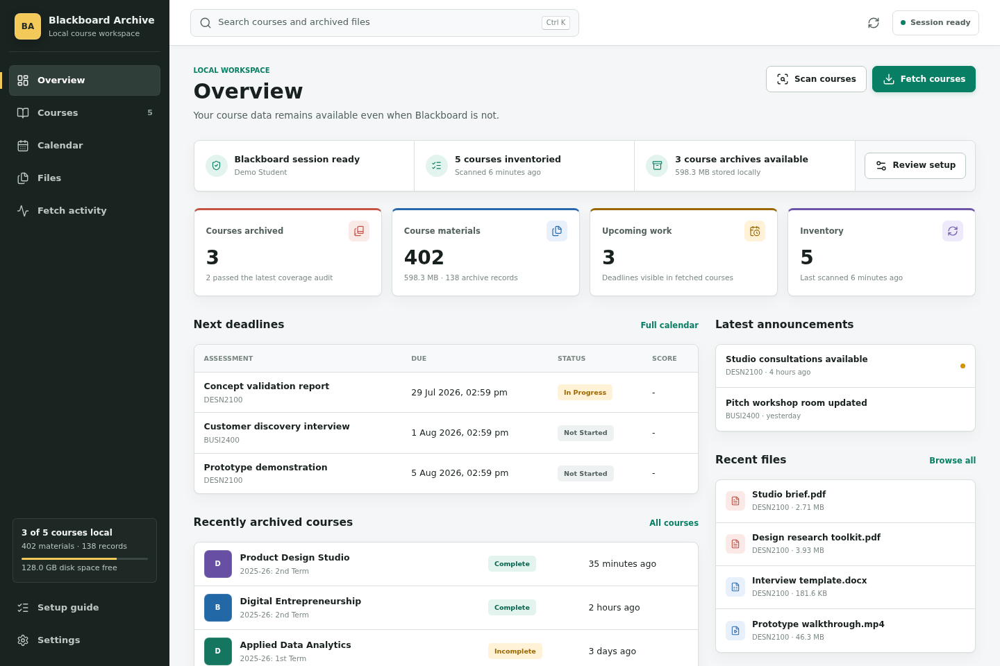
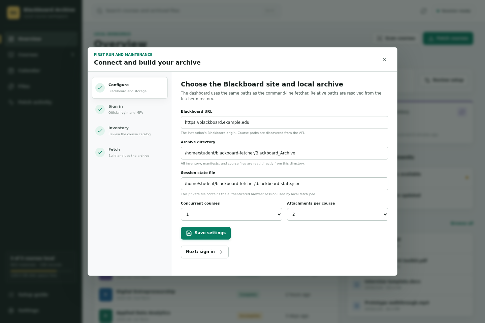
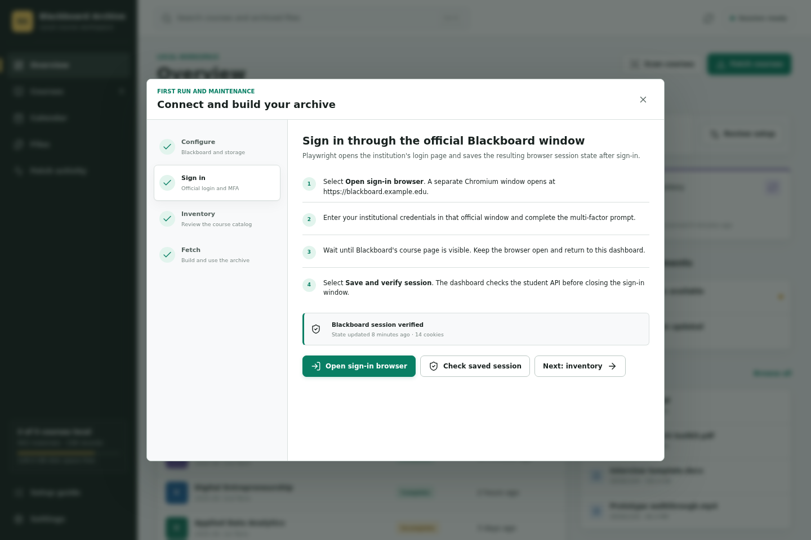
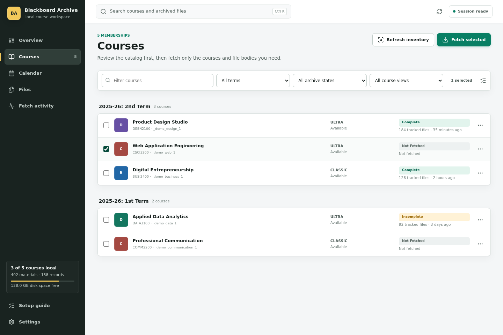
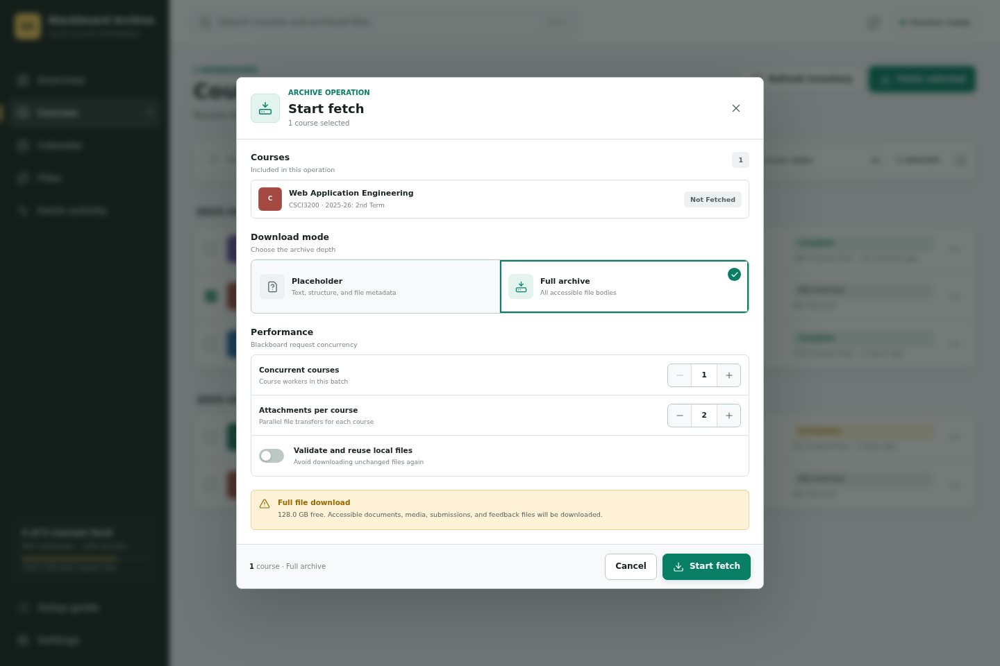
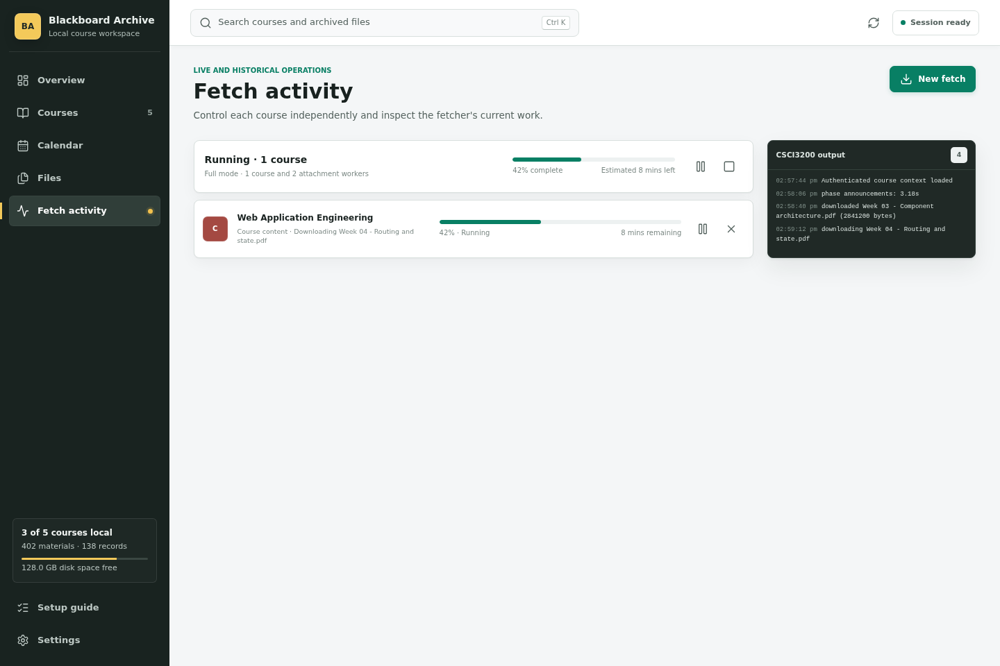
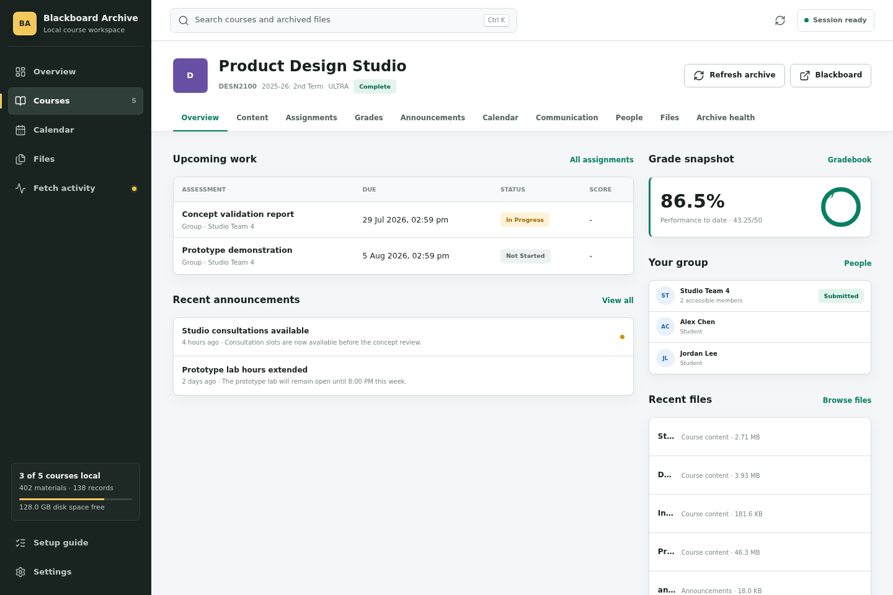
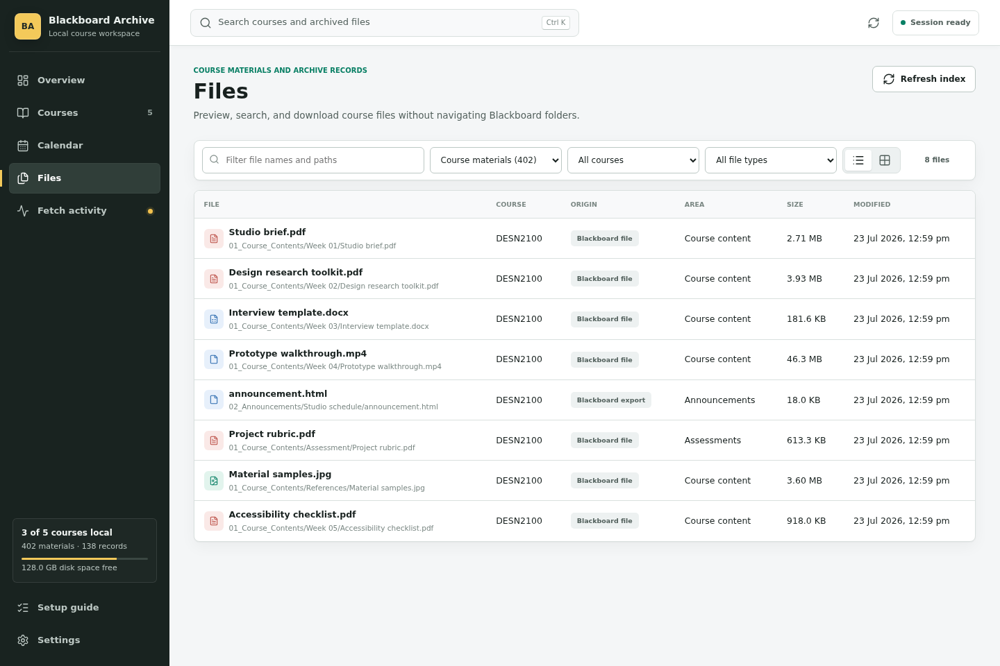

# Blackboard Course Fetcher

[](https://github.com/AgentMrCow/blackboard-course-fetcher/actions/workflows/ci.yml)
[](https://nodejs.org/)
[](LICENSE)

Archives student-visible Blackboard course data, files, submissions, feedback,
grades, announcements, and other accessible course areas. It supports both Ultra
and Classic/Original Course View.

## Responsible Use

This local-first tool only requests content visible to the authenticated
Blackboard user. It is not designed to bypass authorization, course availability,
institution policy, or third-party access controls. Users are responsible for
protecting downloaded course material and complying with their institution's
rules and applicable copyright law.

This project is independent and is not affiliated with, endorsed by, or supported
by Anthology Inc. or any educational institution.

## Requirements

- Node.js 20.19 or newer.
- A Playwright storage-state JSON created after the user completes their own
  Blackboard login and any required multi-factor authentication.
- Playwright with Chromium for browser-only fallback data such as attachment URL
  recovery, Blackboard Annotate, and some legacy submission pages.

Install the dependencies and Playwright's Chromium build in this directory:

```bash
npm ci
npx playwright install chromium
```

## Local Dashboard

The fetcher includes an English local web application for setup, course selection,
live fetch control, and browsing the finished archive. Start it from this directory:

```bash
npm ci
npx playwright install chromium
npm run dashboard
```

Open `http://127.0.0.1:4173`. The server binds to localhost by default and reads
the configured archive files directly; it does not upload them to another service.
For protection against exposing private course material, non-loopback bindings,
cross-origin mutation requests, and archive symlinks that leave a course directory
are rejected.

### Guided Walkthrough

The complete fetch flow takes only a few clicks:



The screenshots below come from the real Svelte dashboard driven by Playwright
with a privacy-safe example catalog. No real account, course, or archive data is
included in the documentation assets.

#### 1. Check Local Readiness

Start the dashboard, open `http://127.0.0.1:4173`, and check the three readiness
items at the top of **Overview**. They show whether the Blackboard session,
course inventory, and local archives are available.



#### 2. Configure Blackboard and Local Storage

Select **Setup guide** in the lower-left navigation. On **Configure**, enter:

1. Your institution's Blackboard origin, such as `https://blackboard.example.edu`.
2. The directory where course archives should be stored.
3. The private Playwright storage-state file used by fetch jobs.
4. Conservative course and attachment concurrency values.

Select **Save settings**, then **Next: sign in**.



#### 3. Sign In and Complete MFA

Select **Open sign-in browser**. Enter credentials only in the institution's
official Blackboard window and complete any MFA prompt there. Once the Blackboard
course page is visible, return to the local dashboard and select
**Save and verify session**.

The dashboard stores browser session state locally. Do not commit or share
`.blackboard-state.json`.



#### 4. Scan and Select Courses

Run **Scan courses** from the setup guide or Overview. Inventory reads course
memberships and term metadata without fetching course bodies. Open **Courses**,
review the term, Ultra or Classic view, availability, and existing archive state,
then select one or more courses.



#### 5. Review the Full Archive Fetch

Select **Fetch selected**. **Full archive** is preselected and downloads all
accessible file bodies together with course structure and text. Adjust worker
counts only when the Blackboard site and local connection can handle the extra
parallel requests.

Enable **Validate and reuse local files** for a repair run after an interrupted
or incomplete fetch. For multi-course full downloads, confirm the additional
bandwidth and storage prompt before starting.



#### 6. Monitor and Control the Fetch

After selecting **Start fetch**, the dashboard opens **Fetch activity**. It shows
the current course, phase, file, progress, transfer counts, logs, and estimated
time remaining. Use the controls beside a batch or course to pause, resume with
validated cache, or cancel it.



#### 7. Browse a Finished Course

Open an archived course to use the local workspace. The tabs combine course
content, assessments, grades, announcements, calendar entries, communication,
people, files, and archive health without returning to Blackboard.



#### 8. Search and Open Every Archived File

Open **Files** to search across all archived courses. Filter by course, file
type, or provenance scope. **Course materials** is the normal browsing view;
**Content exports**, **Archive records**, and **All physical files** expose the
additional local representations maintained by the fetcher.



The dashboard client is built with Svelte, Vite, and TypeScript. A production
build is included under `dashboard/public`, so ordinary users can run the local
server directly. When changing the dashboard source under `dashboard/client`, use:

```bash
npm run dashboard:build
npm run check:client
```

To regenerate the README screenshots and GIF against the current dashboard build,
keep `npm run dashboard` running and execute:

```bash
npm run docs:capture
```

The capture script keeps its deterministic API fixture in `test/`, writes the
versioned images to `docs/assets/tutorial/`, and never starts a real course fetch.
PNG generation only needs Playwright Chromium. GIF generation also requires
`ffmpeg`; when it is unavailable, the script leaves the existing GIF untouched.

For live frontend development, keep `npm run dashboard` running on port 4173 and
run `npm run dashboard:dev` in a second terminal. Vite serves the client on
`http://127.0.0.1:5173` and proxies `/api` to the local Node server.

The setup guide in the dashboard walks through these steps:

1. Set the Blackboard origin, archive directory, and private storage-state path.
2. Open the institution's official sign-in page in a headed browser, complete
   login and MFA there, then save and verify the resulting session.
3. Run an inventory-only scan and inspect terms, course views, availability, and
   existing archive status before choosing a download scope.
4. Start placeholder or full fetches and monitor each course's phase, current
   file, transfer counts, estimated finish time, and recent output.

Running or queued courses can be paused, resumed, or cancelled separately. On
POSIX systems a running process is suspended in place. On Windows, pause stops
the process and resume starts a repair run. Interrupted, failed, incomplete, and
cancelled tasks resume with SHA-256 validated cache reuse.
Cancellation keeps new batches blocked until the old course processes have
actually exited, so a replacement fetch cannot write into the same archive at
the same time. Resuming one paused course also resumes the batch; other paused
courses stay paused. Interrupted courses count as issues, not completed work.

The finished archive is available through course views for content, assessments,
grades, announcements, calendar, discussions, messages, groups, achievements,
and coverage health. The Files view indexes every file regardless of whether it
has a specialized view and paginates large archives. PDF, image, audio, video,
HTML, text, JSON, URL, placeholder, and unresolved records can be previewed locally;
Office and archive files remain available through the browser's open/download
action. A background index keeps file paths and the contents of archived text,
JSON, and URL files searchable without delaying the initial page load. Archived
HTML previews are sandboxed and cannot load external network resources.

The dashboard displays free space on the archive drive and repeats it before a
full fetch. Full mode can consume substantial storage, so clear space before a
large batch when the warning is low. Dashboard job history and the generated file
index live in the ignored `.dashboard-data/` directory and are rebuilt or repaired
automatically when inventory or course fetches change the archive.

The fetcher has two CLI entry points under `bin/`:

- `bin/fetch-blackboard-course.js` archives one course.
- `bin/fetch-blackboard-all.js` inventories enrolled courses, groups them by Blackboard term, and runs the single-course fetcher with bounded concurrency.

The default state filename is `.blackboard-state.json`. It contains active session
cookies: never share or commit it. The included `.gitignore` excludes this file
and the default archive directory.

## Authentication

Open your institution's Blackboard site in a persistent Playwright browser,
complete login and MFA yourself, and then save the browser storage state. For
example, when `playwright-cli` is available:

```bash
playwright-cli -s blackboard open --headed --persistent https://blackboard.example.edu
playwright-cli -s blackboard state-save .blackboard-state.json
```

Replace `https://blackboard.example.edu` with the Blackboard origin used by your
institution. Keep the state file only for as long as the session is needed.
If a JSON API is redirected to sign-in or returns a login page with HTTP 200, the
fetcher reports that the saved session must be refreshed instead of treating the
HTML as malformed course data.

## Safe Workflow

Inventory only; this does not fetch course contents:

```bash
node bin/fetch-blackboard-all.js \
  --base https://blackboard.example.edu \
  --inventory-only \
  --output Blackboard_Archive
```

Test one course. Placeholder mode is the default:

```bash
node bin/fetch-blackboard-all.js \
  --base https://blackboard.example.edu \
  --course-id _12345_1 \
  --output Blackboard_Archive \
  --download-mode placeholder
```

Test a small term batch:

```bash
node bin/fetch-blackboard-all.js \
  --base https://blackboard.example.edu \
  --all \
  --term "2025-26" \
  --limit 2 \
  --output Blackboard_Archive
```

Fetch one course with complete file bodies:

```bash
node bin/fetch-blackboard-all.js \
  --base https://blackboard.example.edu \
  --course-id _12345_1 \
  --download-mode full \
  --output Blackboard_Archive
```

An all-course full download is rejected unless `--confirm-full` is supplied explicitly:

```bash
node bin/fetch-blackboard-all.js \
  --base https://blackboard.example.edu \
  --all \
  --download-mode full \
  --confirm-full \
  --course-concurrency 2 \
  --attachment-concurrency 2 \
  --output Blackboard_Archive
```

Courses are fetched one at a time by default. `--course-concurrency` accepts 1-4,
and `--attachment-concurrency` accepts 1-8 with a default of 2 per course. A
course concurrency of 2 is a conservative option for faster batches; higher
values increase Blackboard load, bandwidth use, and the number of simultaneous
browser fallbacks. Blackboard Annotate captures remain serial because their
viewer tickets are short-lived.

For a repair run after an interrupted or partially failed fetch, reuse only local
files whose saved SHA-256 still matches and request the missing files again:

```bash
node bin/fetch-blackboard-all.js \
  --base https://blackboard.example.edu \
  --course-id _12345_1 \
  --download-mode full \
  --reuse-validated-cache \
  --output Blackboard_Archive
```

This option checks every reused file locally. It intentionally skips remote
freshness validation, so use a normal run when checking Blackboard for updated
versions of existing files.
Placeholder, unresolved, and link-only records are never reused as downloaded
attachment bodies, including older marker records whose flags were lost.

The single-course entry point accepts the same `--base`, `--course-id`, `--state`,
`--output`, `--download-mode`, `--attachment-concurrency`, and
`--reuse-validated-cache` options. `BB_BASE`, `BB_COURSE_ID`, `BB_STATE_FILE`,
`BB_OUT_ROOT`, `BB_ATTACHMENT_CONCURRENCY`, `BB_COURSE_CONCURRENCY`, and
`BB_REUSE_VALIDATED_CACHE=1` are equivalent environment variables where relevant.

File responses are streamed to a temporary file while SHA-256 is calculated, so
large downloads do not need an equally large in-memory buffer. Successful files
are atomically placed in the archive, and partial files are removed after a
failed transfer. The coverage audit reuses hashes already verified during that
run instead of rereading every managed file. Each course `manifest.json` and
`README.md` records phase timings, transferred bytes, validated cache reuse, and
the number of files reread by the final audit.

### Fetch failures and repair

Exit code 1 means the course worker stopped on a fatal error; it is not the
underlying cause. Fetch activity shows a readable reason and retains the original
error in its details. For example, Blackboard `403 Forbidden` with
`bb-rest-course-is-private` means the course is unavailable to the current
account. The course must become accessible again before retrying; refreshing the
session alone cannot restore course permissions. Authentication redirects or
expired-session errors instead require a fresh saved sign-in session. Exit code
2 means the worker finished but its archive has errors or incomplete coverage.

A failed retry retains the previous usable `manifest.json`; partial diagnostics
are stored separately in `manifest.failed.json`. Existing Full-mode archives
containing metadata markers instead of real attachments, or colliding content
paths, are shown as incomplete with a repair explanation. Run a Full fetch with
validated cache reuse to repair accessible files. Healthy binaries can be reused,
but missing bodies must be downloaded again. Files already overwritten by an old
path collision cannot be recovered locally from their manifest alone.

## Output Layout

Terms named `Old 2025-26: 1st Term` and `2025-26: 1st Term` share the canonical path:

```text
Blackboard_Archive/
  courses.json
  README.md
  2025-26/
    1st Term/
      <course id and title>/
    2nd Term/
      <course id and title>/
```

Incremental runs retain the status of existing course archives in the root index.

Inside each course, the fetcher uses stable archive categories instead of assuming
that every instructor chose the same Blackboard menu names:

```text
<course>/
  00_Course_Outline/
  01_Course_Contents/
    <all other Blackboard top-level content, preserving its original hierarchy>/
  02_Announcements/
  03_Calendar/
  04_Discussions/
  05_Messages/
  06_Groups/
  07_Achievements/
  08_Library/       # optional and therefore last
```

Recognized outline, content, and library wrapper names are collapsed into their
fixed categories. Every unrecognized top-level item is retained under
`01_Course_Contents`. The optional Library category is last so its absence does
not leave a gap among the standard archive areas.
Different content IDs with identical, case-insensitive, or sanitized/truncated
titles receive separate folders with stable content-ID suffixes. Children follow
their parent's allocated folder, and a later refetch preserves those paths even
if Blackboard returns the items in a different order.

When an older archive is refreshed, the fetcher migrates the previous numbered
directories before fetching so incremental runs do not leave duplicate layouts.

## Artifact Provenance

Not every file in a course directory is an original Blackboard attachment. The
fetcher keeps those representations because they make Blackboard content usable
offline, but records what each file represents in manifest schema 9:

- **Blackboard original**: downloaded attachment bytes, such as PDF, Office,
  image, audio, video, or instructor-provided text files.
- **Blackboard content export**: a local rendering of a Blackboard content field,
  such as `instructions.html`, `announcement.html`, calendar data, or a quiz
  review. The content comes from Blackboard, while the wrapper file is generated
  by this fetcher.
- **Derived search text**: plain text such as `instructions.txt` generated from a
  richer export solely for local indexing and search.
- **Fetcher record**: manifests, `README.md`, `CURRENT_STATUS.md`, placeholder,
  unresolved, and diagnostic records generated to describe archive state.
- **External resource** or **local file**: captured third-party material, or a
  file present in the course directory that the fetcher does not claim to own.

The dashboard's Files view defaults to **Course materials**, where originals,
usable links, placeholders, and unrecognized local additions remain visible.
**Content exports** exposes the primary offline representation once per logical
Blackboard item; **Archive records** exposes operational metadata; and **All
physical files** shows every stored representation. Search indexes the useful
text derivative but opens the corresponding formatted export, so HTML/text pairs
do not appear as duplicate results.

Existing manifest schema 8 and older archives do not need to be rewritten. The
indexer infers provenance from their download records, assessment/content paths,
and known generated filenames. Unknown files remain visible as local files rather
than being hidden or treated as Blackboard originals.

## Placeholder Mode

Placeholder mode downloads HTML, JSON, plain text, source code, CSV, subtitles, and calendar data. It writes `.placeholder.json` metadata instead of downloading binary bodies such as PDF, Office documents, archives, images, audio, video, FPGA bitstreams, and Blackboard Annotate documents.

Each placeholder records the original filename, MIME type, reported remote size, source URL, and omission reason. The coverage audit reports binary files as covered by placeholders, separately from downloaded files.

In full mode, the fetcher does not treat a failed direct attachment URL as proof
that the file was deleted. It first fetches authenticated, server-rendered
Blackboard pages with ordinary HTTP and searches them for the same resource ID.
Only when those responses do not expose the resource does it run a browser for
client-rendered DOM and network discovery. It retries only same-origin WebDAV
candidates. If no verified candidate works, it writes an `.unresolved.json`
diagnostic and marks the course archive incomplete. For embedded and submission
attachments, a valid file response is retained with a warning when Blackboard's
reported size is stale; standalone course-file resources continue to use strict
reported-size validation.

Classic announcement HTML returned by Blackboard's API can contain an incomplete
`/bbcswebdav/xid-...` image URL even though the browser can display the image. On
direct-download failure, the resolver first compares that `xid` with URLs in the
authenticated Classic/Ultra HTTP response, then falls back to browser DOM and
network traffic only for client-rendered pages. A narrowly validated announcement
URL rule remains as a final fallback. The fetcher uses the final response's
`Content-Disposition` filename and retains the exact source and final response
URLs in the local archive records.

## Quiz Reviews

For each completed question-based assessment, the fetcher derives the Classic
`review.jsp` URL from the generic course, content, grade, column, and attempt IDs
already returned by Blackboard. It first fetches that server-rendered page with
authenticated HTTP. If the response is not a valid review page, it retries with
Playwright. The parser does not depend on the course name, quiz title, question
type, or interface language.

Each archived attempt can contain:

- `quiz_review.raw.html`: the complete HTML returned by Blackboard.
- `quiz_review.html`: a script-free readable review.
- `quiz_review.txt`: searchable plain text.
- `quiz_review.json`: structured metadata, prompts, answer sections, correct-answer markers, visible feedback, and archived question files.
- `quiz_attempt_api.json`: the complete Learn API `assessment` and `questionAttempts` payload when Blackboard exposes it.

Ultra file-submission assignments can share the
`resource/x-bb-asmt-test-link` handler with quizzes. The fetcher checks Blackboard's
assessment subtype and question metadata so those assignments are not falsely
reported as missing quiz reviews. A completed reviewable quiz is marked covered
when either the review page or the Learn API question payload was archived.

## Current Boundaries

- Only content visible to the logged-in student can be archived.
- Unavailable courses remain in the inventory but are skipped by default.
- Ultra discussion forums include recursively archived messages and replies; a discovered but unarchived discussion attachment marks that area incomplete.
- Classic discussion-board IDs and unread counts are archived; Blackboard may restrict board details.
- Classic submission filenames are collected from the legacy submission-history page.
- Attachment UI recovery requires an exact Blackboard resource-ID match and only trusts same-origin WebDAV URLs; unsupported forms are reported as unresolved and make coverage incomplete.
- Instructor-only data, SCORM runtime state, inaccessible third-party LTI data, and other groups' restricted rosters cannot be fetched.
- Legacy quiz payload errors from the Learn API are recovered through the authenticated Classic review page when that page is student-visible.
- A course with an unknown content handler, missing submission payload, unarchived rubric, or failed additional area is marked incomplete rather than silently accepted.

## Architecture

The project uses a local-first modular-monolith architecture with hexagonal
dependency boundaries. `src/application` contains policy that is independent of
I/O, `src/domain` contains pure fetch-job state transitions, `src/adapters`
contains Blackboard/filesystem/HTTP/process implementations, and
`src/composition/dashboard-runtime.js` assembles the local server. Worker
processes isolate long-running fetch, indexing, and browser tasks while the
course archive remains plain files. Job JSON persistence and Node process control
implement injected ports, so either can be replaced without changing dashboard
routes or worker arguments. Archive queries and file-index construction likewise
use a contained filesystem repository; course paths and symlinks are checked
before archive files are listed or read. Authentication and course-inventory
lifecycle policy also use injected session-gateway and process-runner ports, so
the HTTP transport does not own browser IPC or inventory CLI details. Dashboard
requests pass through a guarded router with separate workspace, archive,
fetch-job, and static controllers instead of one monolithic route dispatcher.
File-index cache validation, worker IPC, progress, and coalesced rebuild requests
are likewise separated behind filesystem and process adapters coordinated by the
application layer. The single-course engine now delegates CLI input validation,
manifest and coverage policy, saved-state loading, and progress and phase timing
to focused modules. Course discovery and course fetching share an authenticated
Blackboard REST adapter for cookie scoping, retry policy, and configurable
pagination. Direct file transfers use a course-root filesystem adapter and an
application service for placeholders, conditional and SHA-256 cache reuse,
streamed integrity checks, and duplicate-content handling. Attachment recovery
is separately coordinated by an application service: an authenticated HTTP
gateway runs first, a Playwright gateway observes client-rendered DOM and network
requests only when needed, and pure domain policy accepts only exact same-origin
Blackboard resource IDs before applying the narrow announcement-owner rule.
Quiz-review pages, feedback menu downloads, and Classic submission inventories
also use focused Playwright gateways; the engine receives plain results and keeps
archive paths, integrity checks, manifest records, and coverage decisions. A
shared Blackboard Extras gateway captures Achievements responses and short-lived
Annotate sync data while the archive module retains the complete payloads and
owns their local schemas. No course-fetch module outside `src/adapters` directly
automates a browser.
The composition root is the only place that builds concrete
repositories, runners, coordinators, and the dashboard server; missing runtime
dependencies fail immediately instead of activating hidden defaults.

See [docs/architecture.md](docs/architecture.md) for module ownership, runtime
data boundaries, dependency rules, and the staged job-queue refactor.

## Development

Run the unit tests without contacting Blackboard:

```bash
npm test
```

All test scripts live under `test/`. The suite replays deterministic fixtures
under `test/fixtures/blackboard/` for Ultra content pagination, assessment
attempts, Classic submission observations, malformed payloads, and expired
sessions.

Run syntax checks:

```bash
npm run check
```

Run the complete local CI sequence:

```bash
npm run ci
```

## Contributing and Security

See [CONTRIBUTING.md](CONTRIBUTING.md) for development setup, architecture rules,
fixture anonymization, and pull-request expectations.

Report security issues through the private process in
[SECURITY.md](SECURITY.md). Never post Playwright storage state, cookies, signed
URLs, credentials, student data, submissions, grades, or private course material
in a public GitHub issue.

## License

Released under the [MIT License](LICENSE).
